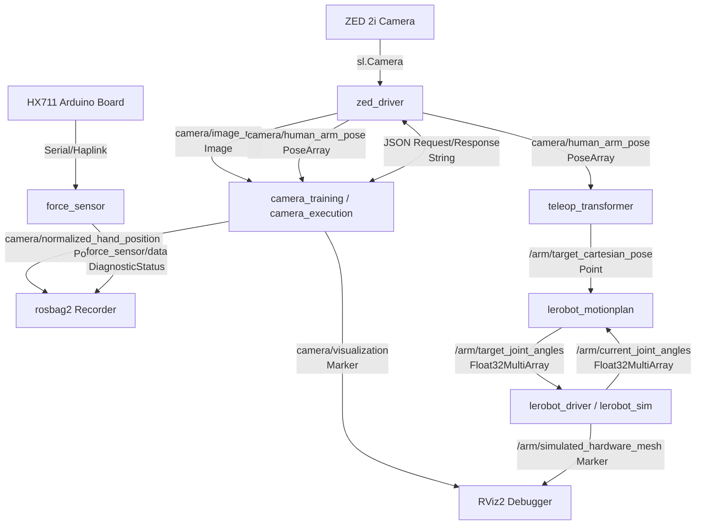

# Surgical Arm ROS2 Modular Architecture & Visual Calibration Guide

This document provides a comprehensive system architecture, node directory, ROSbag data format reference, and mathematical specification for the visual marker calibration pipeline within the `surgical-arm-ros2` repository.

---

## 1. System Architecture Overview

The system is designed around modular ROS2 nodes that separate hardware interfaces (ZED 2i camera, Haplink serial sensor, SO-101 arm follower bus) from kinematic math solvers and pose transformation layers. This allows the system to easily switch between physical hardware control and Rviz-simulated execution.

### System Data Flow Directory



---

## 2. Node Reference Directory

### `zed_driver`
* **Source:** [zed_driver.py](file:///home/connor/robotics_projects/surgical-arm-ros2/src/arm_control/arm_control/zed_driver.py)
* **Description:** Exclusively interfaces with the ZED 2i camera hardware, publishing raw sensor feeds and tracking data, and hosting plane segmentation services to prevent concurrent device locking errors.
* **Key Tasks:**
  * Runs the camera frame loop at 15 Hz.
  * Streams skeletal tracking joint poses and BGR images.
  * Listens to plane hit coordinates and resolves 3D plane center and boundaries.
* **Subscribers:**
  * `camera/get_plane/request` (`std_msgs/msg/String`)
* **Publishers:**
  * `camera/image_raw` (`sensor_msgs/msg/Image`)
  * `camera/human_arm_pose` (`geometry_msgs/msg/PoseArray`)
  * `camera/get_plane/response` (`std_msgs/msg/String`)

### `camera_training`
* **Source:** [camera_training.py](file:///home/connor/robotics_projects/surgical-arm-ros2/src/arm_control/arm_control/camera_training.py)
* **Description:** Decoupled application interface that processes training demonstrations relative to clicked plane centroids.
* **Key Tasks:**
  * Displays raw frames from `zed_driver` and registers mouse clicks to trigger plane detection.
  * Computes the hand offset relative to the plane Centroid and publishes normalized coordinates.
  * Orchestrates `rosbag2` recording.
* **Subscribers:**
  * `camera/image_raw` (`sensor_msgs/msg/Image`)
  * `camera/human_arm_pose` (`geometry_msgs/msg/PoseArray`)
  * `camera/get_plane/response` (`std_msgs/msg/String`)
* **Publishers:**
  * `camera/visualization` (`visualization_msgs/msg/Marker`)
  * `camera/normalized_hand_position` (`geometry_msgs/msg/Point`)
  * `camera/get_plane/request` (`std_msgs/msg/String`)

### `camera_execution`
* **Source:** [camera_execution.py](file:///home/connor/robotics_projects/surgical-arm-ros2/src/arm_control/arm_control/camera_execution.py)
* **Description:** Teleoperation client mirroring the training interface, mapping human gestures to active workspace commands.
* **Subscribers:**
  * `camera/image_raw` (`sensor_msgs/msg/Image`)
  * `camera/human_arm_pose` (`geometry_msgs/msg/PoseArray`)
  * `camera/get_plane/response` (`std_msgs/msg/String`)
* **Publishers:**
  * `camera/visualization` (`visualization_msgs/msg/Marker`)
  * `camera/normalized_hand_position` (`geometry_msgs/msg/Point`)
  * `camera/get_plane/request` (`std_msgs/msg/String`)

### `teleop_transformer`
* **Source:** [teleop_transformer.py](file:///home/connor/robotics_projects/surgical-arm-ros2/src/arm_control/arm_control/teleop_transformer.py) / [training_transformer.py](file:///home/connor/robotics_projects/surgical-arm-ros2/src/arm_control/arm_control/training_transformer.py)
* **Description:** Bridges the raw human joint telemetry to valid Cartesian coordinate targets for the robot's workspace.
* **Key Tasks:**
  * Inverts the Y-axis to map camera frame orientation to the robot coordinate frame.
  * Scales down human arm movements (default scale: `0.75`).
  * Applies hard-clipped safety bounding boxes to prevent joint collisons:
    * $X \in [0.05, 0.42]$ m
    * $Y \in [-0.25, 0.25]$ m
    * $Z \in [0.02, 0.35]$ m
* **Subscribers:**
  * `camera/human_arm_pose` (`geometry_msgs/msg/PoseArray`)
* **Publishers:**
  * `/arm/target_cartesian_pose` (`geometry_msgs/msg/Point`)
  * `/arm/target_pose_marker` (`visualization_msgs/msg/Marker`): Translucent green target sphere visualizer for RViz.

### `lerobot_motionplan`
* **Source:** [lerobot_motionplan.py](file:///home/connor/robotics_projects/surgical-arm-ros2/src/arm_control/arm_control/lerobot_motionplan.py)
* **Description:** The central kinematics solver for the 6-DoF SO-101 robot arm.
* **Key Tasks:**
  * Houses the Product of Exponentials (PoE) Forward Kinematics representation.
  * Solves Inverse Kinematics (IK) numerically using a iterative Jacobian Transpose solver.
  * Enforces joint limits (in radians) before publishing commands.
* **Subscribers:**
  * `/arm/target_cartesian_pose` (`geometry_msgs/msg/Point`)
  * `/arm/current_joint_angles` (`std_msgs/msg/Float32MultiArray`)
* **Publishers:**
  * `/arm/target_joint_angles` (`std_msgs/msg/Float32MultiArray`): Array of 6 target angles in degrees.
  * `/arm/current_cartesian_pose` (`geometry_msgs/msg/Point`): Computes live FK positions and updates RViz.

### `lerobot_driver`
* **Source:** [lerobot_driver.py](file:///home/connor/robotics_projects/surgical-arm-ros2/src/arm_control/arm_control/lerobot_driver.py)
* **Description:** Low-level hardware actuator driver using the Hugging Face `lerobot` follower bus api.
* **Key Tasks:**
  * Initializes serial links over USB (typically `/dev/ttyACM0`).
  * Interpolates joint paths with step size limits (`2.0` deg maximum change per iteration) to prevent jerking.
  * Broadcasts physical encoder positions back to ROS2.
* **Subscribers:**
  * `/arm/target_joint_angles` (`std_msgs/msg/Float32MultiArray`)
* **Publishers:**
  * `/arm/current_joint_angles` (`std_msgs/msg/Float32MultiArray`)

### `lerobot_sim`
* **Source:** [lerobot_sim.py](file:///home/connor/robotics_projects/surgical-arm-ros2/src/arm_control/arm_control/lerobot_sim.py)
* **Description:** Stand-in hardware mock driver used when physical hardware is disconnected.
* **Key Tasks:**
  * Simulates the 20Hz hardware controller loop.
  * Computes the positions of all intermediate arm links and publishes them as structural visual lines.
* **Publishers:**
  * `/arm/simulated_hardware_mesh` (`visualization_msgs/msg/Marker`): cyan line-strip representing joint-to-joint arm geometry.

### `force_sensor`
* **Source:** [force_sensor.py](file:///home/connor/robotics_projects/surgical-arm-ros2/src/arm_control/arm_control/force_sensor.py)
* **Description:** Captures high-frequency data from a load cell connected via a Haplink serial USB node.
* **Services:**
  * `force_sensor/tare` (`std_srvs/srv/Trigger`): Recalculates zero-load offset.
  * `force_sensor/calibrate` (`std_srvs/srv/Trigger`): Dynamically sets scaling factors using a standard calibration weight (default: 200g).

---

## 3. Data Recording & ROSbags

Demonstration datasets are stored inside the `training_bags` directory. The recorder uses the high-performance **MCAP** file system.

### Recorded Bag Schema
* **Format:** MCAP (`.mcap`)
* **ROS Distro:** Jazzy
* **Target Topics:**
  * `/camera/normalized_hand_position` (`geometry_msgs/msg/Point`) ~10 Hz
  * `/camera/human_arm_pose` (`geometry_msgs/msg/PoseArray`) ~10 Hz
  * `/camera/visualization` (`visualization_msgs/msg/Marker`) ~20 Hz

> [!NOTE]
> The current datasets stored in `training_bags` do not contain recorded `force_sensor/data` or robot joint angle topics. To collect full-state action trajectories, you must execute playback while recording joint encoder outputs.

---

## 4. Visual Marker Eye-to-Hand Calibration

To map hand positions from the camera-defined plane Centroid to targets that the robot's kinematics planner can execute, we define a static coordinate transform.

### Mathematical Framework

Let:
* $C$ be the Camera coordinate frame.
* $R$ be the Robot base coordinate frame.
* $EE$ be the End-Effector coordinate frame.
* $Tag$ be the physical AprilTag/ArUco frame mounted on the robot gripper.
* $Centroid$ be the calibration plane coordinate frame.

We seek the static transformation matrix:

$$T_{R}^{\text{Centroid}} = \begin{bmatrix} R_{3 \times 3} & \vec{t}_{3 \times 1} \\ \vec{0}^T & 1 \end{bmatrix}$$

Using the mounting offset of the tag on the gripper ($T_{EE}^{Tag}$) and the robot's Forward Kinematics ($T_{R}^{EE}$), the tag position in robot coordinates is:

$$T_{R}^{Tag} = T_{R}^{EE} \cdot T_{EE}^{Tag}$$

Simultaneously, the camera views the tag, giving its position relative to the camera ($T_{C}^{Tag}$). The static camera-to-robot transform ($T_{R}^{C}$) is solved via:

$$T_{R}^{C} = T_{R}^{Tag} \cdot \left(T_{C}^{Tag}\right)^{-1}$$

With $T_{R}^{C}$ established, we map the centroid to the robot base:

$$T_{R}^{\text{Centroid}} = T_{R}^{C} \cdot T_{C}^{\text{Centroid}}$$

For any normalized coordinate $\vec{p}_{\text{Centroid}}$ streamed from your demonstration bags, the physical target point $\vec{p}_{R}$ in the robot workspace is:

$$\vec{p}_{R} = T_{R}^{\text{Centroid}} \cdot \vec{p}_{\text{Centroid}}$$

---

## 5. Execution Workflow

### Local Compilation

```bash
# Navigate to workspace root
cd /home/connor/robotics_projects/surgical-arm-ros2

# Source python environment and build packages
source venv/bin/activate
colcon build

# Sourcing workspace underlay
source install/setup.bash
```

### Running Simulated Teleoperation & Debugging
Run the following commands in separate terminals to spin up the simulation workspace:

1. **Launch Simulated Driver:**
   ```bash
   ros2 run arm_control lerobot_sim
   ```
2. **Launch ZED Camera Driver:**
   ```bash
   ros2 run arm_control zed_driver
   ```
3. **Launch Motion Planner:**
   ```bash
   ros2 run arm_control lerobot_motionplan
   ```
4. **Launch Teleop Coordinate Transformer:**
   ```bash
   ros2 run arm_control teleop_transformer
   ```
5. **Launch Application UI (Training or Execution):**
   ```bash
   ros2 run arm_control camera_training
   ```
6. **Launch RViz Visualizer:**
   ```bash
   rviz2
   ```
7. **Play Demonstration Rosbag:**
   ```bash
   ros2 bag play training_bags/training_episode_20260622_174229/
   ```
